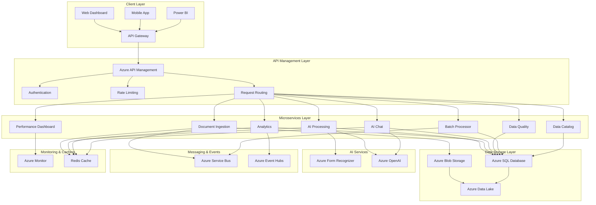

#  **Comprehensive Azure Data Engineering Platform Guide**

##  **Table of Contents**

1. [Project Overview](#project-overview)
2. [Architecture Deep Dive](#architecture-deep-dive)
3. [Azure Services Integration](#azure-services-integration)
4. [Deployment Guide](#deployment-guide)
5. [Data Engineering Features](#data-engineering-features)
6. [API Documentation](#api-documentation)
7. [Monitoring & Operations](#monitoring--operations)
8. [Security & Compliance](#security--compliance)
9. [Cost Optimization](#cost-optimization)
10. [Troubleshooting](#troubleshooting)
11. [Best Practices](#best-practices)

---

##  **Project Overview**

### **What is this Platform?**

This is a **comprehensive Data Engineering Platform** built on Microsoft Azure that combines:

- **Document Intelligence** - AI-powered document processing and analysis
- **Data Engineering** - ETL/ELT pipelines, data quality, and governance
- **Analytics** - Real-time and batch analytics with business intelligence
- **AI Chat** - Intelligent Q&A system for data insights
- **Data Catalog** - Complete data lineage and asset management

### **Key Capabilities**

| Capability | Description | Business Value |
|------------|-------------|----------------|
| **Document Processing** | Extract text, entities, and insights from documents | Automate document workflows |
| **Data Quality** | Validate, profile, and monitor data quality | Ensure data reliability |
| **ETL/ELT Pipelines** | Transform and load data at scale | Enable data-driven decisions |
| **Data Lineage** | Track data flow and dependencies | Ensure data governance |
| **Real-time Analytics** | Process streaming data in real-time | Enable instant insights |
| **AI Chat** | Natural language queries on data | Democratize data access |

---

##  **Architecture Deep Dive**

### **High-Level Architecture**



### **Microservices Architecture**

#### **1. Document Ingestion Service** (Port 8000)
- **Purpose**: Handle document uploads and initial processing
- **Key Features**:
  - File upload validation
  - Document metadata extraction
  - Integration with Azure Form Recognizer
  - Real-time processing status updates

#### **2. AI Processing Service** (Port 8001)
- **Purpose**: Advanced AI-powered document analysis
- **Key Features**:
  - Text extraction and OCR
  - Entity recognition and classification
  - Document structure analysis
  - Confidence scoring

#### **3. Analytics Service** (Port 8002)
- **Purpose**: Generate insights and business intelligence
- **Key Features**:
  - Real-time metrics calculation
  - Performance analytics
  - Business intelligence reports
  - Data visualization

#### **4. AI Chat Service** (Port 8003)
- **Purpose**: Natural language interface for data queries
- **Key Features**:
  - Conversational AI using Azure OpenAI
  - Document context search
  - Intelligent Q&A
  - Conversation management

#### **5. Performance Dashboard** (Port 8004)
- **Purpose**: Real-time system monitoring and metrics
- **Key Features**:
  - System health monitoring
  - Performance metrics visualization
  - Alert management
  - Resource utilization tracking

#### **6. Data Quality Service** (Port 8006)  **NEW**
- **Purpose**: Comprehensive data quality management
- **Key Features**:
  - Data validation and profiling
  - Quality metrics calculation
  - Real-time quality monitoring
  - Data quality reports

#### **7. Batch Processor Service** (Port 8007)  **NEW**
- **Purpose**: ETL/ELT batch processing and data orchestration
- **Key Features**:
  - Configurable ETL pipelines
  - Data transformation workflows
  - Batch processing scheduling
  - Pipeline monitoring

#### **8. Data Catalog Service** (Port 8008)  **NEW**
- **Purpose**: Data governance and lineage tracking
- **Key Features**:
  - Data asset catalog
  - Lineage tracking and visualization
  - Impact analysis
  - Data discovery and search

---

##  **Azure Services Integration**

### **Core Azure Services**

#### **1. Azure Container Apps**
- **Purpose**: Host microservices
- **Configuration**:
  ```yaml
  environment: production
  resource_group: rg-docintel-prod
  container_apps:
    - document-ingestion
    - ai-processing
    - analytics
    - ai-chat
    - data-quality
    - batch-processor
    - data-catalog
    - performance-dashboard
  ```

#### **2. Azure SQL Database**
- **Purpose**: Primary data storage
- **Configuration**:
  ```sql
  -- Database: docintel_prod
  -- Service Tier: Business Critical
  -- Compute: 4 vCores
  -- Storage: 1TB
  -- Backup: 7 days
  ```

#### **3. Azure Blob Storage**
- **Purpose**: Document and file storage
- **Configuration**:
  ```yaml
  storage_account: docintelstorage
  containers:
    - documents (Hot tier)
    - processed (Cool tier)
    - analytics (Archive tier)
  ```

#### **4. Azure Data Lake Storage Gen2**
- **Purpose**: Data warehouse and analytics storage
- **Configuration**:
  ```yaml
  storage_account: docinteldatalake
  containers:
    - raw-data
    - processed-data
    - analytics-data
    - ml-models
  ```

#### **5. Azure Cognitive Services**
- **Purpose**: AI capabilities
- **Services**:
  - Form Recognizer (Document analysis)
  - OpenAI (GPT-4, Embeddings)
  - Translator (Multi-language support)

#### **6. Azure API Management**
- **Purpose**: API gateway and management
- **Configuration**:
  ```yaml
  sku: Developer
  publisher_email: admin@yourcompany.com
  policies:
    - rate_limiting
    - authentication
    - request_transformation
  ```

#### **7. Azure Monitor & Application Insights**
- **Purpose**: Monitoring and observability
- **Configuration**:
  ```yaml
  application_insights:
    instrumentation_key: <your-key>
    connection_string: <your-connection-string>
  log_analytics:
    workspace_id: <your-workspace-id>
  ```

#### **8. Azure Redis Cache**
- **Purpose**: Caching and session management
- **Configuration**:
  ```yaml
  sku: Standard
  family: C
  capacity: 1
  ```

#### **9. Azure Service Bus**
- **Purpose**: Message queuing and pub/sub
- **Configuration**:
  ```yaml
  namespace: docintel-servicebus
  queues:
    - document-processing
    - analytics-processing
    - batch-processing
  topics:
    - system-events
    - data-quality-alerts
  ```

#### **10. Azure Event Hubs**
- **Purpose**: Event streaming and real-time data
- **Configuration**:
  ```yaml
  namespace: docintel-eventhubs
  event_hubs:
    - document-events
    - analytics-events
    - system-events
  ```

---

##  **Deployment Guide**

### **Prerequisites**

1. **Azure Subscription** with appropriate permissions
2. **Azure CLI** installed and configured
3. **Docker** installed locally
4. **Python 3.11+** installed
5. **Git** for version control

### **Step 1: Clone and Setup**

```bash
# Clone the repository
git clone <your-repo-url>
cd document-intelligence-platform

# Install dependencies
pip install -r requirements.txt

# Set up environment variables
cp env.example .env
# Edit .env with your Azure credentials
```

### **Step 2: Azure Resource Deployment**

#### **Option A: Using Azure CLI**

```bash
# Login to Azure
az login

# Create resource group
az group create --name rg-docintel-prod --location eastus

# Deploy infrastructure using Bicep
az deployment group create \
  --resource-group rg-docintel-prod \
  --template-file infrastructure/main.bicep \
  --parameters @infrastructure/parameters.json
```

#### **Option B: Using Azure Portal**

1. **Create Resource Group**
   - Name: `rg-docintel-prod`
   - Region: `East US`

2. **Deploy SQL Database**
   - Server: `docintel-sql-server`
   - Database: `docintel_prod`
   - Service Tier: `Business Critical`

3. **Deploy Storage Account**
   - Name: `docintelstorage`
   - Performance: `Standard`
   - Replication: `LRS`

4. **Deploy Container Apps Environment**
   - Name: `docintel-container-env`
   - Log Analytics Workspace: `docintel-logs`

### **Step 3: Database Setup**

```sql
-- Connect to your SQL Database
-- Run the schema creation script
-- This will create all necessary tables and indexes

-- Example: Create documents table
CREATE TABLE documents (
    document_id NVARCHAR(50) PRIMARY KEY,
    user_id NVARCHAR(50) NOT NULL,
    file_name NVARCHAR(255) NOT NULL,
    file_size BIGINT NOT NULL,
    content_type NVARCHAR(100) NOT NULL,
    status NVARCHAR(20) DEFAULT 'uploaded',
    created_at DATETIME2 DEFAULT GETUTCDATE(),
    updated_at DATETIME2 DEFAULT GETUTCDATE()
);

-- Create indexes for performance
CREATE INDEX IX_documents_user_id ON documents(user_id);
CREATE INDEX IX_documents_status ON documents(status);
CREATE INDEX IX_documents_created_at ON documents(created_at);
```

### **Step 4: Container Deployment**

#### **Build and Push Images**

```bash
# Build all microservices
docker-compose build

# Tag images for Azure Container Registry
docker tag docintel-document-ingestion:latest yourregistry.azurecr.io/docintel-document-ingestion:latest
docker tag docintel-ai-processing:latest yourregistry.azurecr.io/docintel-ai-processing:latest
# ... repeat for all services

# Push to Azure Container Registry
az acr login --name yourregistry
docker push yourregistry.azurecr.io/docintel-document-ingestion:latest
# ... push all images
```

#### **Deploy to Azure Container Apps**

```bash
# Create container app for document ingestion
az containerapp create \
  --name docintel-document-ingestion \
  --resource-group rg-docintel-prod \
  --environment docintel-container-env \
  --image yourregistry.azurecr.io/docintel-document-ingestion:latest \
  --target-port 8000 \
  --ingress external \
  --env-vars \
    SQL_CONNECTION_STRING="your-connection-string" \
    BLOB_STORAGE_CONNECTION_STRING="your-blob-connection" \
    REDIS_URL="your-redis-connection"

# Repeat for all microservices
```

### **Step 5: API Management Setup**

```bash
# Create API Management instance
az apim create \
  --name docintel-apim \
  --resource-group rg-docintel-prod \
  --publisher-email admin@yourcompany.com \
  --sku-name Developer

# Import APIs
az apim api import \
  --resource-group rg-docintel-prod \
  --service-name docintel-apim \
  --api-id document-ingestion \
  --path documents \
  --specification-format OpenApi \
  --specification-path api-specs/document-ingestion.yaml
```

### **Step 6: Monitoring Setup**

```bash
# Create Application Insights
az monitor app-insights component create \
  --app docintel-insights \
  --location eastus \
  --resource-group rg-docintel-prod

# Create Log Analytics Workspace
az monitor log-analytics workspace create \
  --workspace-name docintel-logs \
  --resource-group rg-docintel-prod \
  --location eastus
```

---

##  **Data Engineering Features**

### **1. Data Quality Framework**

#### **Validation Rules**
```python
# Example: Document validation
validation_rules = {
    "required_fields": ["document_id", "user_id", "file_name"],
    "data_types": {
        "file_size": "int64",
        "created_at": "datetime64[ns]"
    },
    "format_validation": {
        "content_type": ["application/pdf", "image/jpeg", "image/png"]
    },
    "business_rules": {
        "file_size": {"min": 0, "max": 100 * 1024 * 1024}  # 100MB limit
    }
}
```

#### **Quality Metrics**
```python
# Calculate data quality metrics
quality_metrics = {
    "completeness": 0.95,    # 95% of required fields populated
    "accuracy": 0.92,        # 92% of data values are correct
    "consistency": 0.88,     # 88% of data follows consistent format
    "validity": 0.94,        # 94% of data passes validation rules
    "timeliness": 0.90,      # 90% of data is fresh (< 24 hours)
    "uniqueness": 0.97       # 97% of records are unique
}
```

### **2. ETL/ELT Pipelines**

#### **Pipeline Configuration**
```yaml
# Example: Document Processing Pipeline
pipelines:
  document_processing:
    steps:
      - step_id: extract_documents
        transformation_type: clean
        source_query: "SELECT * FROM documents WHERE status = 'uploaded'"
        target_table: staging_documents
        config:
          clean_columns: ["file_name", "content_type"]
          validate_required: ["document_id", "user_id"]
      
      - step_id: enrich_documents
        transformation_type: enrich
        source_query: "SELECT * FROM staging_documents"
        target_table: enriched_documents
        config:
          add_columns:
            file_extension: "SUBSTRING(file_name, CHARINDEX('.', file_name) + 1, LEN(file_name))"
            file_category: "CASE WHEN content_type LIKE '%pdf%' THEN 'document' ELSE 'other' END"
      
      - step_id: aggregate_documents
        transformation_type: aggregate
        source_query: "SELECT * FROM enriched_documents"
        target_table: document_aggregates
        config:
          group_by: ["user_id", "file_category"]
          aggregations:
            total_documents: "COUNT(*)"
            total_size: "SUM(file_size)"
```

#### **Pipeline Execution**
```python
# Execute pipeline programmatically
from src.microservices.batch_processor.etl_pipeline import etl_pipeline

# Execute document processing pipeline
execution = await etl_pipeline.execute_pipeline("document_processing")

# Check execution status
status = await etl_pipeline.get_execution_status(execution.execution_id)
```

### **3. Data Lineage Tracking**

#### **Asset Registration**
```python
# Register a data asset
from src.microservices.data_catalog.lineage_tracker import lineage_tracker, DataAsset, DataAssetType

asset = DataAsset(
    asset_id="table_documents",
    name="documents",
    asset_type=DataAssetType.TABLE,
    description="Main documents table",
    location="sql://docintel-sql-server/docintel_prod/documents",
    schema={
        "columns": [
            {"name": "document_id", "type": "NVARCHAR(50)", "nullable": False},
            {"name": "user_id", "type": "NVARCHAR(50)", "nullable": False},
            {"name": "file_name", "type": "NVARCHAR(255)", "nullable": False}
        ]
    },
    owner="data_team",
    tags=["documents", "structured", "primary"]
)

await lineage_tracker.register_asset(asset)
```

#### **Lineage Visualization**
```python
# Get lineage information
lineage = await lineage_tracker.get_asset_lineage("table_documents")

# Get impact analysis
impact = await lineage_tracker.get_impact_analysis("table_documents")

# Search for assets
results = await lineage_tracker.search_assets("documents", DataAssetType.TABLE)
```

---

##  **API Documentation**

### **Data Quality Service API**

#### **Validate Document Data**
```http
POST /validate/document
Content-Type: application/json

{
    "table_name": "documents",
    "data": {
        "document_id": "doc_123",
        "user_id": "user_456",
        "file_name": "contract.pdf",
        "file_size": 1024000,
        "content_type": "application/pdf"
    }
}
```

**Response:**
```json
{
    "document_id": "doc_123",
    "validation_results": [
        {
            "field_name": "file_size",
            "rule_type": "range",
            "passed": true,
            "message": "File size is within acceptable range"
        }
    ],
    "summary": {
        "total_validations": 5,
        "passed": 5,
        "failed": 0,
        "critical_errors": 0
    }
}
```

#### **Get Quality Metrics**
```http
POST /quality/metrics
Content-Type: application/json

{
    "table_name": "documents",
    "sample_size": 1000
}
```

**Response:**
```json
{
    "table_name": "documents",
    "metrics": {
        "completeness": 0.95,
        "accuracy": 0.92,
        "consistency": 0.88,
        "validity": 0.94,
        "timeliness": 0.90,
        "uniqueness": 0.97,
        "overall_score": 0.93,
        "quality_level": "good"
    }
}
```

### **Batch Processor Service API**

#### **Execute Pipeline**
```http
POST /pipelines/document_processing/execute
Content-Type: application/json

{
    "pipeline_name": "document_processing"
}
```

**Response:**
```json
{
    "message": "Pipeline document_processing execution started",
    "execution_id": "document_processing_20241201_143022",
    "status": "started",
    "timestamp": "2024-12-01T14:30:22Z"
}
```

#### **Get Execution Status**
```http
GET /executions/document_processing_20241201_143022
```

**Response:**
```json
{
    "execution_id": "document_processing_20241201_143022",
    "pipeline_name": "document_processing",
    "status": "completed",
    "start_time": "2024-12-01T14:30:22Z",
    "end_time": "2024-12-01T14:32:15Z",
    "records_processed": 1500,
    "records_failed": 0,
    "execution_log": [
        "Pipeline document_processing started at 2024-12-01T14:30:22Z",
        "Executing step: Extract Raw Documents",
        "Step completed: Extract Raw Documents - 1500 records processed",
        "Pipeline completed successfully at 2024-12-01T14:32:15Z"
    ]
}
```

### **Data Catalog Service API**

#### **Search Assets**
```http
POST /search
Content-Type: application/json

{
    "query": "documents",
    "asset_type": "table"
}
```

**Response:**
```json
{
    "query": "documents",
    "total_results": 3,
    "assets": [
        {
            "asset_id": "table_documents",
            "name": "documents",
            "asset_type": "table",
            "description": "Main documents table",
            "location": "sql://docintel-sql-server/docintel_prod/documents",
            "owner": "data_team",
            "tags": ["documents", "structured", "primary"]
        }
    ],
    "search_time_ms": 45.2
}
```

#### **Get Asset Lineage**
```http
GET /lineage/table_documents?direction=both
```

**Response:**
```json
{
    "asset": {
        "asset_id": "table_documents",
        "name": "documents",
        "asset_type": "table"
    },
    "upstream_assets": [
        {
            "asset_id": "api_document_upload",
            "name": "Document Upload API",
            "asset_type": "api"
        }
    ],
    "downstream_assets": [
        {
            "asset_id": "table_document_analytics",
            "name": "document_analytics",
            "asset_type": "table"
        }
    ],
    "relationships": [
        {
            "relationship_id": "rel_001",
            "source_asset_id": "api_document_upload",
            "target_asset_id": "table_documents",
            "lineage_type": "direct",
            "transformation_description": "API data insertion"
        }
    ],
    "lineage_depth": 2,
    "impact_score": 0.75
}
```

---

##  **Monitoring & Operations**

### **Azure Monitor Integration**

#### **Application Insights Configuration**
```yaml
# Application Insights setup
application_insights:
  instrumentation_key: "your-instrumentation-key"
  connection_string: "your-connection-string"
  
  # Custom metrics
  custom_metrics:
    - document_processing_time
    - data_quality_score
    - pipeline_execution_time
    - api_response_time
  
  # Custom events
  custom_events:
    - document_uploaded
    - pipeline_completed
    - data_quality_alert
    - system_error
```

#### **Log Analytics Queries**
```kusto
// Document processing performance
requests
| where timestamp > ago(1h)
| where name contains "document"
| summarize 
    avg(duration) as avg_duration,
    count() as total_requests,
    countif(success == false) as failed_requests
| project avg_duration, total_requests, failed_requests

// Data quality trends
customMetrics
| where name == "data_quality_score"
| where timestamp > ago(24h)
| summarize avg(value) by bin(timestamp, 1h)
| render timechart

// Pipeline execution status
customEvents
| where name == "pipeline_completed"
| where timestamp > ago(7d)
| summarize count() by tostring(customDimensions.pipeline_name)
| render piechart
```

### **Performance Monitoring**

#### **Key Performance Indicators (KPIs)**
```yaml
performance_metrics:
  api_performance:
    - response_time_p95: < 500ms
    - response_time_p99: < 1000ms
    - error_rate: < 1%
    - throughput: > 1000 req/min
  
  data_processing:
    - document_processing_time: < 30s
    - pipeline_execution_time: < 5min
    - data_quality_score: > 0.9
    - batch_processing_throughput: > 10000 records/min
  
  system_health:
    - cpu_utilization: < 70%
    - memory_utilization: < 80%
    - disk_io: < 80%
    - network_throughput: < 80%
```

#### **Alerting Rules**
```yaml
alert_rules:
  - name: "High API Response Time"
    condition: "avg(response_time) > 1000ms"
    severity: "warning"
    action: "notify_team"
  
  - name: "Data Quality Degradation"
    condition: "data_quality_score < 0.8"
    severity: "critical"
    action: "page_oncall"
  
  - name: "Pipeline Failure"
    condition: "pipeline_status == 'failed'"
    severity: "critical"
    action: "page_oncall"
  
  - name: "High Error Rate"
    condition: "error_rate > 5%"
    severity: "warning"
    action: "notify_team"
```

---

##  **Security & Compliance**

### **Authentication & Authorization**

#### **Azure Active Directory Integration**
```yaml
# AAD configuration
azure_active_directory:
  tenant_id: "your-tenant-id"
  client_id: "your-client-id"
  client_secret: "your-client-secret"
  
  # Role-based access control
  roles:
    - name: "data_engineer"
      permissions: ["read", "write", "execute_pipelines"]
    - name: "data_analyst"
      permissions: ["read", "query_data"]
    - name: "data_admin"
      permissions: ["read", "write", "execute_pipelines", "manage_users"]
```

#### **API Security**
```yaml
# API Management security policies
security_policies:
  - name: "rate_limiting"
    type: "rate-limit"
    config:
      calls: 1000
      renewal_period: 60
  
  - name: "authentication"
    type: "validate-jwt"
    config:
      issuer: "https://login.microsoftonline.com/your-tenant-id/v2.0"
      audience: "your-api-audience"
  
  - name: "cors"
    type: "cors"
    config:
      allowed_origins: ["https://yourdomain.com"]
      allowed_methods: ["GET", "POST", "PUT", "DELETE"]
```

### **Data Security**

#### **Encryption**
```yaml
# Data encryption configuration
encryption:
  at_rest:
    - azure_sql_database: "Transparent Data Encryption (TDE)"
    - azure_blob_storage: "Service-managed keys"
    - azure_data_lake: "Service-managed keys"
  
  in_transit:
    - api_communication: "TLS 1.2+"
    - database_connections: "TLS 1.2+"
    - storage_access: "HTTPS"
  
  application_level:
    - sensitive_data: "AES-256 encryption"
    - api_keys: "Azure Key Vault"
    - connection_strings: "Azure Key Vault"
```

#### **Data Classification**
```yaml
# Data classification levels
data_classification:
  public:
    - document_metadata
    - system_logs
    - performance_metrics
  
  internal:
    - user_analytics
    - business_metrics
    - processing_logs
  
  confidential:
    - document_content
    - user_personal_data
    - api_keys
  
  restricted:
    - authentication_tokens
    - encryption_keys
    - admin_credentials
```

### **Compliance**

#### **GDPR Compliance**
```yaml
# GDPR compliance measures
gdpr_compliance:
  data_subject_rights:
    - right_to_access: "API endpoint for data export"
    - right_to_rectification: "API endpoint for data update"
    - right_to_erasure: "API endpoint for data deletion"
    - right_to_portability: "API endpoint for data export"
  
  data_protection:
    - data_minimization: "Only collect necessary data"
    - purpose_limitation: "Use data only for stated purposes"
    - storage_limitation: "Retain data only as long as necessary"
    - accuracy: "Ensure data accuracy and currency"
  
  technical_measures:
    - encryption: "Encrypt all personal data"
    - access_control: "Role-based access control"
    - audit_logging: "Log all data access and modifications"
    - data_anonymization: "Anonymize data when possible"
```

#### **SOC 2 Compliance**
```yaml
# SOC 2 compliance measures
soc2_compliance:
  security:
    - access_controls: "Multi-factor authentication"
    - system_monitoring: "24/7 monitoring and alerting"
    - vulnerability_management: "Regular security assessments"
    - incident_response: "Documented incident response procedures"
  
  availability:
    - system_uptime: "99.9% availability target"
    - backup_recovery: "Automated backups and recovery"
    - disaster_recovery: "Multi-region deployment"
    - capacity_planning: "Automated scaling"
  
  processing_integrity:
    - data_validation: "Comprehensive data validation"
    - error_handling: "Robust error handling and logging"
    - data_quality: "Data quality monitoring"
    - audit_trails: "Complete audit trails"
```

---

##  **Cost Optimization**

### **Azure Cost Management**

#### **Resource Optimization**
```yaml
# Cost optimization strategies
cost_optimization:
  compute:
    - azure_container_apps: "Use consumption plan for variable workloads"
    - azure_sql_database: "Use serverless tier for development"
    - azure_redis_cache: "Use basic tier for development"
  
  storage:
    - azure_blob_storage: "Use appropriate access tiers"
      - hot: "Frequently accessed data"
      - cool: "Infrequently accessed data"
      - archive: "Rarely accessed data"
    - azure_data_lake: "Use lifecycle management policies"
  
  networking:
    - azure_api_management: "Use developer tier for development"
    - azure_monitor: "Use basic tier for development"
    - data_transfer: "Minimize cross-region data transfer"
```

#### **Cost Monitoring**
```yaml
# Cost monitoring and alerts
cost_monitoring:
  budget_alerts:
    - monthly_budget: "$5000"
      - warning_threshold: "80%"
      - critical_threshold: "100%"
    - daily_budget: "$200"
      - warning_threshold: "90%"
      - critical_threshold: "100%"
  
  cost_analysis:
    - resource_group_costs: "Monitor costs by resource group"
    - service_costs: "Monitor costs by Azure service"
    - tag_based_costs: "Monitor costs by tags"
    - trend_analysis: "Analyze cost trends over time"
```

### **Resource Sizing**

#### **Development Environment**
```yaml
# Development environment sizing
dev_environment:
  azure_sql_database:
    service_tier: "Basic"
    compute: "5 DTUs"
    storage: "2GB"
    estimated_cost: "$5/month"
  
  azure_container_apps:
    plan: "Consumption"
    estimated_cost: "$10/month"
  
  azure_blob_storage:
    tier: "Hot"
    estimated_cost: "$5/month"
  
  total_estimated_cost: "$20/month"
```

#### **Production Environment**
```yaml
# Production environment sizing
prod_environment:
  azure_sql_database:
    service_tier: "Business Critical"
    compute: "4 vCores"
    storage: "1TB"
    estimated_cost: "$500/month"
  
  azure_container_apps:
    plan: "Consumption"
    estimated_cost: "$200/month"
  
  azure_blob_storage:
    tier: "Hot"
    estimated_cost: "$100/month"
  
  total_estimated_cost: "$800/month"
```

---

##  **Troubleshooting**

### **Common Issues and Solutions**

#### **1. Service Startup Issues**

**Problem**: Services fail to start
```bash
# Check container logs
docker-compose logs service-name

# Check Azure Container Apps logs
az containerapp logs show --name service-name --resource-group rg-docintel-prod
```

**Solution**:
- Verify environment variables are set correctly
- Check Azure service connectivity
- Ensure proper permissions are configured

#### **2. Database Connection Issues**

**Problem**: Cannot connect to Azure SQL Database
```bash
# Test connection
sqlcmd -S your-server.database.windows.net -d your-database -U your-username -P your-password
```

**Solution**:
- Check firewall rules
- Verify connection string
- Ensure SQL Server is running

#### **3. Performance Issues**

**Problem**: Slow API responses
```bash
# Check Application Insights
# Query: requests | where timestamp > ago(1h) | summarize avg(duration) by name
```

**Solution**:
- Check database query performance
- Verify caching is working
- Monitor resource utilization

#### **4. Data Quality Issues**

**Problem**: Data quality scores are low
```bash
# Check data quality service
curl -X POST http://localhost:8006/quality/metrics \
  -H "Content-Type: application/json" \
  -d '{"table_name": "documents", "sample_size": 1000}'
```

**Solution**:
- Review validation rules
- Check data source quality
- Update transformation logic

### **Debugging Tools**

#### **Application Insights Queries**
```kusto
// Find slow requests
requests
| where timestamp > ago(1h)
| where duration > 1000
| order by duration desc
| project timestamp, name, duration, success

// Find errors
exceptions
| where timestamp > ago(1h)
| order by timestamp desc
| project timestamp, type, message, outerMessage

// Check custom metrics
customMetrics
| where timestamp > ago(1h)
| order by timestamp desc
| project timestamp, name, value
```

#### **Azure Monitor Alerts**
```yaml
# Create alert for high error rate
alert_rule:
  name: "High Error Rate"
  condition: "error_rate > 5%"
  action_group: "notify-team"
  severity: "warning"
```

---

##  **Best Practices**

### **Development Best Practices**

#### **1. Code Organization**
```python
# Use proper project structure
src/
 microservices/
    service-name/
       main.py
       models.py
       services.py
       tests/
 shared/
    config/
    storage/
    cache/
    monitoring/
 tests/
```

#### **2. Error Handling**
```python
# Implement proper error handling
try:
    result = await process_document(document)
    return {"status": "success", "result": result}
except ValidationError as e:
    logger.error(f"Validation error: {str(e)}")
    raise HTTPException(status_code=400, detail=str(e))
except Exception as e:
    logger.error(f"Unexpected error: {str(e)}")
    raise HTTPException(status_code=500, detail="Internal server error")
```

#### **3. Logging**
```python
# Use structured logging
import logging
import json

logger = logging.getLogger(__name__)

# Log with context
logger.info("Document processed", extra={
    "document_id": document_id,
    "user_id": user_id,
    "processing_time": processing_time,
    "status": "success"
})
```

### **Data Engineering Best Practices**

#### **1. Data Quality**
```python
# Implement data quality checks
def validate_document_data(data):
    validation_results = []
    
    # Check required fields
    required_fields = ["document_id", "user_id", "file_name"]
    for field in required_fields:
        if field not in data or data[field] is None:
            validation_results.append({
                "field": field,
                "rule": "required",
                "passed": False,
                "message": f"Required field {field} is missing"
            })
    
    return validation_results
```

#### **2. ETL Pipeline Design**
```python
# Design idempotent pipelines
class ETLPipeline:
    def __init__(self):
        self.checkpoint_table = "pipeline_checkpoints"
    
    async def execute_pipeline(self, pipeline_name):
        # Check if pipeline already running
        if await self.is_pipeline_running(pipeline_name):
            raise Exception("Pipeline already running")
        
        # Set checkpoint
        await self.set_checkpoint(pipeline_name, "started")
        
        try:
            # Execute pipeline steps
            await self.execute_steps(pipeline_name)
            await self.set_checkpoint(pipeline_name, "completed")
        except Exception as e:
            await self.set_checkpoint(pipeline_name, "failed", str(e))
            raise
```

#### **3. Data Lineage**
```python
# Track data lineage
async def track_data_lineage(source_asset, target_asset, transformation):
    relationship = LineageRelationship(
        source_asset_id=source_asset.asset_id,
        target_asset_id=target_asset.asset_id,
        lineage_type=LineageType.TRANSFORMED,
        transformation_description=transformation,
        created_at=datetime.utcnow()
    )
    
    await lineage_tracker.add_lineage_relationship(relationship)
```

### **Azure Best Practices**

#### **1. Resource Naming**
```yaml
# Use consistent naming convention
naming_convention:
  resource_group: "rg-{project}-{environment}"
  storage_account: "{project}storage{environment}"
  sql_server: "{project}-sql-{environment}"
  container_app: "{project}-{service}-{environment}"
```

#### **2. Security**
```yaml
# Implement security best practices
security:
  - use_managed_identity: true
  - enable_private_endpoints: true
  - use_azure_key_vault: true
  - enable_audit_logging: true
  - implement_rbac: true
```

#### **3. Monitoring**
```yaml
# Implement comprehensive monitoring
monitoring:
  - enable_application_insights: true
  - enable_log_analytics: true
  - set_up_alerts: true
  - create_dashboards: true
  - implement_health_checks: true
```

---

##  **Conclusion**

This comprehensive Data Engineering Platform on Microsoft Azure provides:

- **Complete Data Engineering Capabilities** - ETL/ELT, data quality, governance
- **AI-Powered Document Processing** - Intelligent document analysis and insights
- **Scalable Architecture** - Microservices-based, cloud-native design
- **Enterprise-Grade Security** - Authentication, authorization, encryption
- **Comprehensive Monitoring** - Real-time monitoring and alerting
- **Cost Optimization** - Efficient resource utilization and cost management

The platform is ready for production deployment and can be used for various data engineering roles and use cases. Follow the deployment guide and best practices to ensure successful implementation and operation.

---

##  **Support**

For questions, issues, or contributions:

1. **Documentation**: Check this guide and inline code comments
2. **Issues**: Create GitHub issues for bugs or feature requests
3. **Discussions**: Use GitHub discussions for questions
4. **Contributions**: Submit pull requests for improvements

**Happy Data Engineering! **